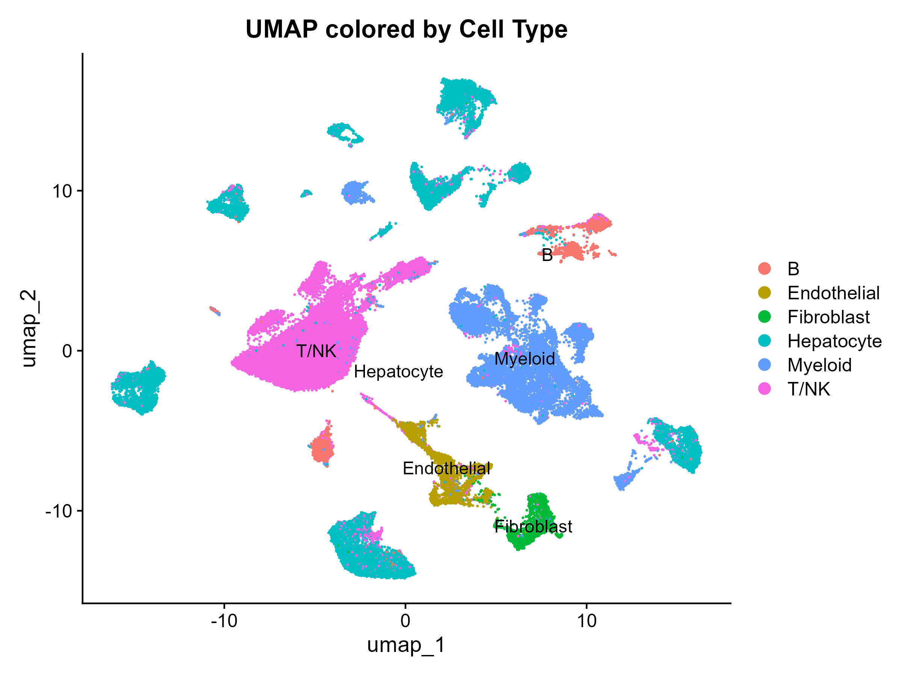
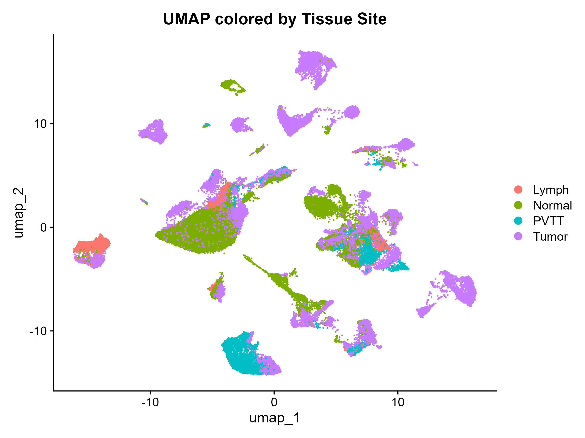
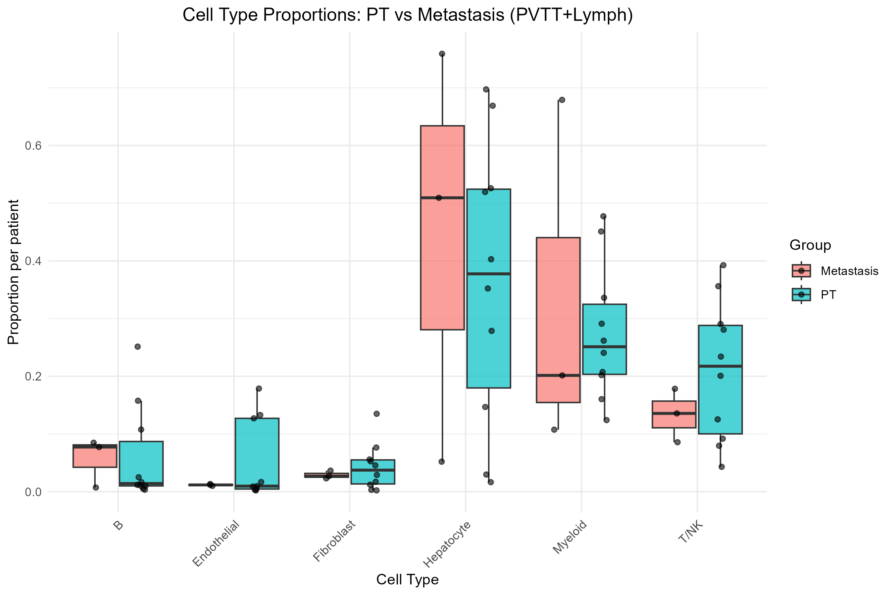
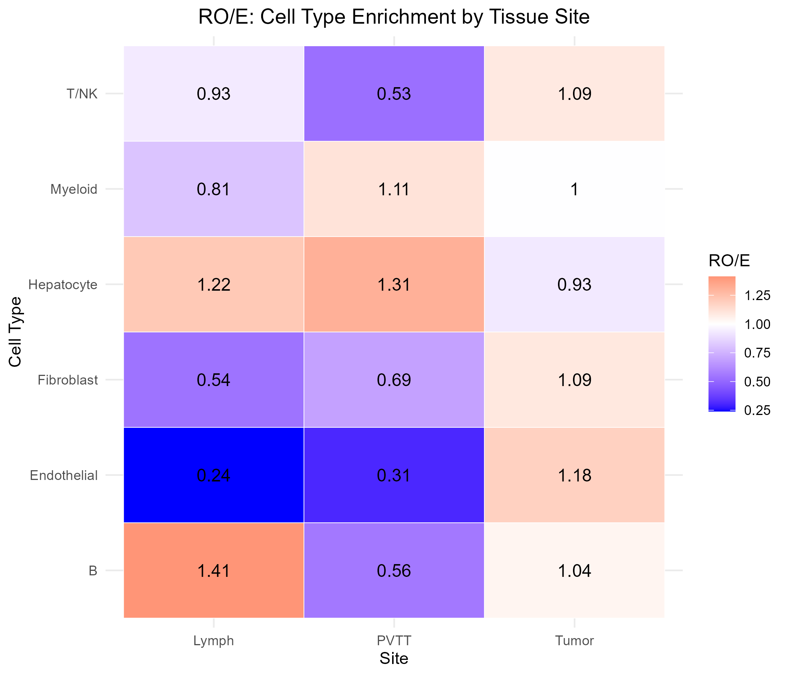
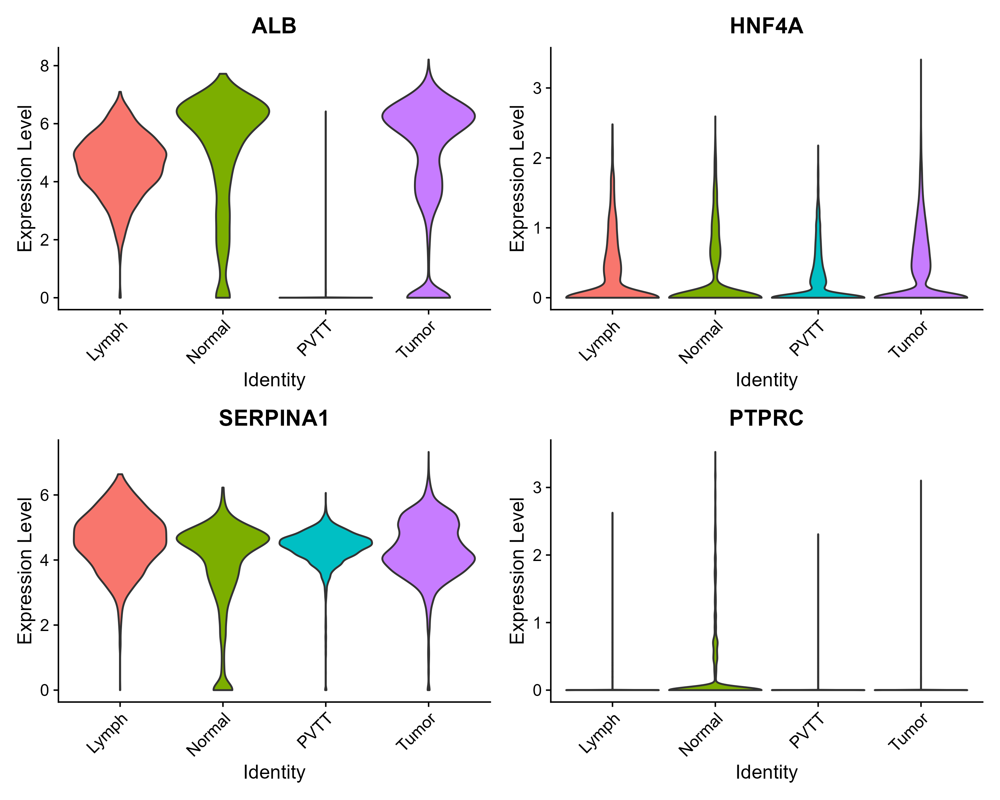
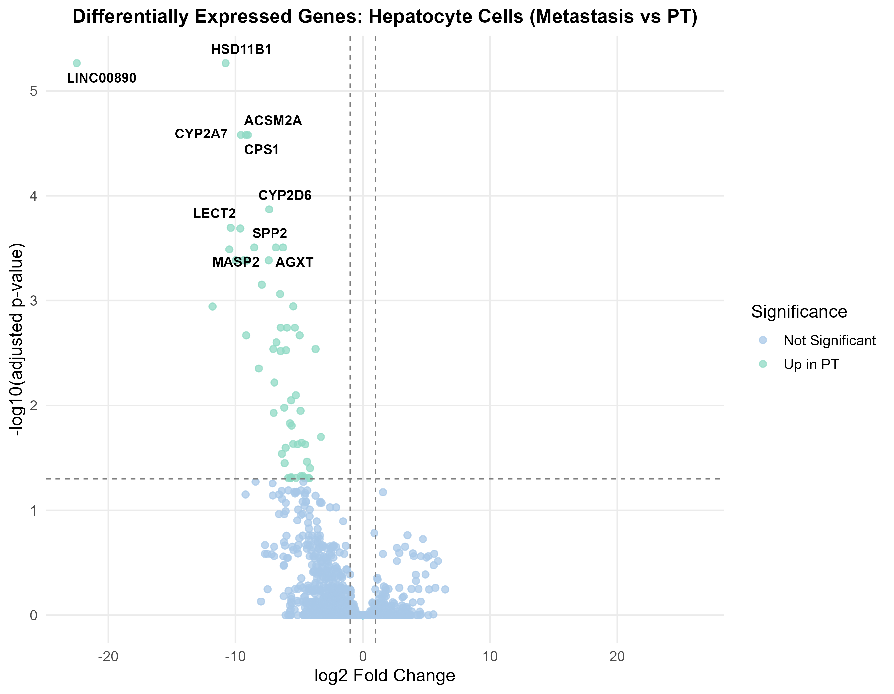

# Single-Cell RNA-seq Analysis of Hepatocellular Carcinoma (HCC) Metastasis

`R` · `Seurat` · `DESeq2` · **Status: Completed** · **License: MIT**

**Author:** Mariam Hany Samir ([@hanymaryam515-boop](https://github.com/hanymaryam515-boop))

## Overview

This repository contains a complete single-cell RNA-sequencing (scRNA-seq) analysis pipeline investigating the cellular composition and transcriptional changes associated with **metastatic spread of Hepatocellular Carcinoma (HCC)**. The analysis compares the tumor microenvironment of the **primary tumor (PT)** against **metastatic sites** — the **portal vein tumor thrombus (PVTT)** and **lymph node metastases (MLN)** — to characterize how cellular composition and gene expression shift as HCC progresses and spreads.

The project uses publicly available data and a standard **Seurat (R)** single-cell workflow, from raw count loading through quality control, clustering, cell-type annotation, compositional analysis, and differential gene expression.

**Status:** ✅ Completed

---

## Data Source

- **Dataset:** [GEO accession GSE149614](https://www.ncbi.nlm.nih.gov/geo/query/acc.cgi?acc=GSE149614) — a published single-cell RNA-seq dataset of HCC patients
- **Tissue sites sampled:** Primary Tumor (PT / Tumor), Portal Vein Tumor Thrombus (PVTT), Metastatic Lymph Node (MLN / Lymph), and adjacent Normal liver tissue
- **Starting size:** 71,915 cells × 25,712 genes

---

## Analysis Pipeline

### 1. Data Loading & Quality Control
- Raw count matrices loaded into a Seurat object
- Cells filtered on mitochondrial content (`percent.mt < 10%`)
- **67,101 cells** retained after QC

### 2. Normalization & Dimensionality Reduction
- `NormalizeData` for log-normalization of counts
- `FindVariableFeatures` — top 2,000 highly variable genes
- `ScaleData` and `RunPCA` — 30 principal components
- UMAP embedding computed on the PCA space for visualization

### 3. Clustering & Cell-Type Annotation
Cells were clustered and annotated into **6 major cell populations** based on canonical marker genes:

| Cell Type | Description |
|---|---|
| Hepatocyte | Liver parenchymal / tumor epithelial cells (ALB, HNF4A, SERPINA1) |
| T/NK | T lymphocytes and NK cells |
| Myeloid | Monocytes/macrophages and other myeloid cells |
| B | B lymphocytes |
| Endothelial | Vascular endothelial cells |
| Fibroblast | Stromal fibroblasts |

<p align="center">
  
  
</p>

*Left: UMAP of all 67,101 cells colored by annotated cell type. Right: the same embedding colored by tissue site of origin (Tumor, PVTT, Lymph, Normal).*

### 4. Compositional Analysis
- Per-patient cell-type proportions computed and compared between **PT** and **Metastasis (PVTT + Lymph)** groups
- **Wilcoxon rank-sum test** run per cell type to assess significance of proportion shifts
- **Ratio of Observed to Expected (RO/E)** calculated per cell type, per tissue site, to quantify tissue-specific enrichment/depletion of each population

<p align="center">
  
  
</p>

### 5. Marker Validation / Contamination Check
- Hepatocyte calls in PVTT and Lymph samples were cross-checked using canonical hepatocyte markers (**ALB, HNF4A, SERPINA1**) against the immune marker **PTPRC**, to rule out ambient RNA contamination or misclassification in non-liver tissue sites

<p align="center">
  
</p>

### 6. Differential Expression (Pseudobulk)
- **Pseudobulk DE analysis** performed on Hepatocyte cells using **DESeq2**, aggregating counts at the patient level
- Comparison: **Metastasis (n = 3 patients) vs. PT (n = 10 patients)**
- Results visualized as a volcano plot of log2 fold change vs. adjusted p-value

<p align="center">
  
</p>

---

## Key Findings

- Six major cell populations were consistently identified across all tissue sites, with **Hepatocyte and Myeloid/T-NK populations** dominating tumor and metastatic samples.
- Cell-type proportions trended differently between PT and metastatic sites (e.g., lower T/NK and Endothelial fractions in metastasis), though differences did not reach statistical significance at the current sample size (Wilcoxon p > 0.05 for all cell types).
- RO/E analysis showed clear site-specific enrichment patterns — for example, **Endothelial cells were strongly depleted** in PVTT and Lymph relative to Tumor tissue (RO/E ≈ 0.24–0.31), while **Hepatocytes were enriched** in PVTT and Lymph (RO/E ≈ 1.2–1.3).
- Hepatocyte marker validation confirmed that ALB/HNF4A/SERPINA1-expressing cells in PVTT/Lymph showed minimal PTPRC co-expression, supporting that these are genuine tumor-derived hepatocyte-like cells rather than contamination.
- Pseudobulk differential expression of Hepatocyte cells revealed that metastatic hepatocytes show **widespread downregulation of core liver-function genes** relative to PT (e.g., *CYP2A7, CYP2D6, CPS1, HSD11B1, AGXT, LECT2*), consistent with a loss of hepatocyte differentiation/function during metastatic spread — no genes were significantly upregulated in metastasis at the applied significance threshold.

---

## Repository Structure

All files are kept together at the root of the repository:

```
├── hcc project coding.R                                # Full R/Seurat analysis script
│
├── 01_umap_by_celltype.png                             # UMAP colored by cell type
├── 02_umap_by_tissue.png                               # UMAP colored by tissue site
├── 04_umap_by_site.png                                 # UMAP highlighting PVTT distribution
├── 06_celltype_proportions_boxplot.png                 # PT vs Metastasis proportions
├── 07_RO_E_heatmap.png                                 # RO/E enrichment heatmap
├── 08_hepatocyte_marker_check.png                      # Hepatocyte marker validation
├── 11_volcano_DE_hepatocyte_final.png                  # Volcano plot: Hepatocyte DE, Metastasis vs PT
│
├── 01_celltype_proportions_PT_vs_Metastasis.csv        # Per-patient cell type proportions
├── 02_celltype_proportions_PT_vs_Metastasis.csv        # Per-patient cell type proportions (extended)
├── 03_celltype_proportions_stats.csv                   # Wilcoxon test results per cell type
├── 04_RO_E_celltype_by_site.csv                        # RO/E values per cell type per site
├── 05_DE_pseudobulk_hepatocyte_PT_vs_Metastasis.csv    # Pseudobulk DESeq2 results
│
└── README.md                                           # Project documentation
```

## Tools & Technologies

- **R** with **Seurat** — QC, normalization, PCA/UMAP, clustering
- **DESeq2** — pseudobulk differential expression
- **ggplot2** — all figures (UMAPs, boxplots, heatmaps, volcano plots)

## Reproducing the Analysis

1. Download the raw data from GEO ([GSE149614](https://www.ncbi.nlm.nih.gov/geo/query/acc.cgi?acc=GSE149614))
2. Run `hcc project coding.R` — it covers the full pipeline from QC and normalization through clustering, annotation, compositional analysis, and pseudobulk DE
3. Running the script regenerates all the `.csv` result tables and `.png` figures listed above

## Author

**Mariam Hany Samir**
GitHub: [@hanymaryam515-boop](https://github.com/hanymaryam515-boop)

## Contact

For questions about this project, please open an issue in this repository.
